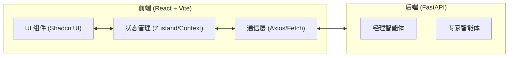
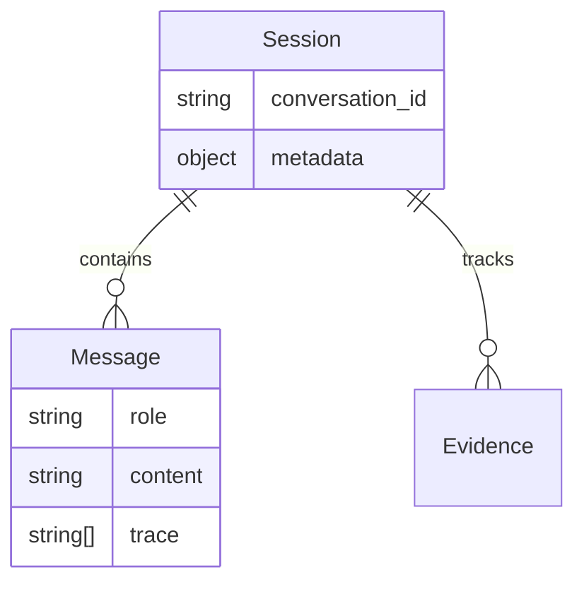

## 1. 架构设计
系统采用前后端分离架构，前端使用 React + Vite 驱动，后端为已有的 FastAPI 智能体系统。

## 2. 技术选型
- **前端框架**: React@18 (组件化开发)
- **构建工具**: Vite (极速开发体验)
- **样式方案**: Tailwind CSS (原子化 CSS) + Shadcn UI (高质量组件库)
- **状态管理**: Zustand (轻量级状态共享)
- **图标库**: Lucide React (极简图标)
- **动画**: Framer Motion (仿 Codex 平滑动效)

## 3. 路由定义
| 路由 | 用途 |
|-------|---------|
| / | 核心智能体交互主界面 |

## 4. 接口定义
前端将对接后端 `/diagnose` 接口：
- **Request**: `DiagnoseRequest` (incident, service, conversation_id)
- **Response**: `DiagnoseResponse` (status, summary, recommended_action, evidence, trace, metadata)

## 5. 核心模块结构
- `src/components`: 包含 ChatMessage, TraceViewer, EvidenceCard, MetadataBar 等组件。
- `src/hooks`: 封装 API 调用与会话逻辑。
- `src/store`: 管理全局会话状态与 Token 统计。

## 6. 数据模型
### 6.1 前端状态模型

