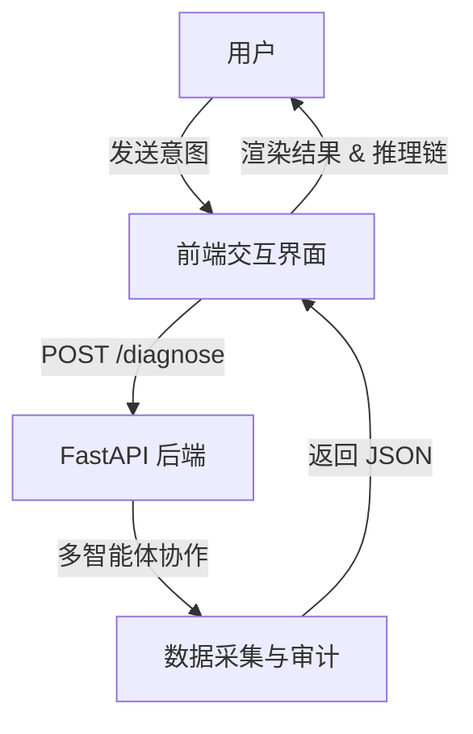

## 1. 产品概述
构建一个面向开发者的“智能旅游助手”前端界面。该系统将后端多智能体（Manager, Weather Specialist, Travel Specialist, Critic）的能力具象化，提供类似 OpenAI Codex 的极简、高效、深色主题的交互体验。用户可以通过对话获取定制化的旅游方案，并实时监控 Agent 的推理过程、证据链以及 Token 消耗成本。

## 2. 核心功能

### 2.1 用户角色
| 角色 | 注册方式 | 核心权限 |
|------|----------|----------|
| 开发者/用户 | 无需注册（本地/演示版） | 发起旅游咨询、查看 Agent 推理追踪、监控成本 |

### 2.2 功能模块
1. **对话主视图**: 沉浸式聊天窗口，支持 Markdown 渲染。
2. **推理看板 (Trace Panel)**: 实时展示 Agent 的思考路径（Thought-Action-Observation）。
3. **证据链侧栏 (Evidence Sidebar)**: 展示后端采集到的天气、机票、RAG 知识库原始证据。
4. **性能监控器 (Metadata Monitor)**: 底部状态栏展示 Token 消耗、估算成本、响应延迟。

### 2.3 页面详情
| 页面名称 | 模块名称 | 功能描述 |
|-----------|-------------|---------------------|
| 主交互页面 | 聊天窗口 | 仿 Codex 风格，支持代码块和结构化输出渲染 |
| 主交互页面 | 推理追踪 | 展开/折叠显示 Agent 的每一步调度细节 |
| 主交互页面 | 证据展示 | 卡片式展示采集到的原始数据来源与详情 |
| 主交互页面 | 状态栏 | 实时统计当前会话的性能指标 |

## 3. 核心流程
用户输入旅游意图 -> 前端调用后端 API -> 后端多智能体协作 -> 返回结构化数据 -> 前端实时渲染推理过程与最终方案。

## 4. 用户界面设计

### 4.1 设计风格
- **主色调**: 深色主题 (#0D0D0D), 强调色使用 Codex 经典的青色 (#00FFA3) 或浅灰色。
- **按钮样式**: 极简边框，悬浮变色，无阴影平面化设计。
- **字体**: 等宽字体 (JetBrains Mono, Fira Code) 用于推理链，系统默认无衬线字体用于正文。
- **布局**: 左侧对话流，右侧证据与元数据面板，底部输入框。

### 4.2 页面设计概览
| 页面名称 | 模块名称 | UI 元素 |
|-----------|-------------|-------------|
| 主页面 | 对话区域 | 深色背景，气泡式或流式文本，青色强调符号 |
| 主页面 | 侧边栏 | 半透明模糊效果，卡片式证据展示 |
| 主页面 | 输入框 | 极简线条，支持多行输入，回车发送 |

### 4.3 响应式
- 优先桌面端（Desktop-first）体验，针对开发者宽屏优化。
- 移动端采用响应式布局，侧边栏改为底部抽屉式弹出。
